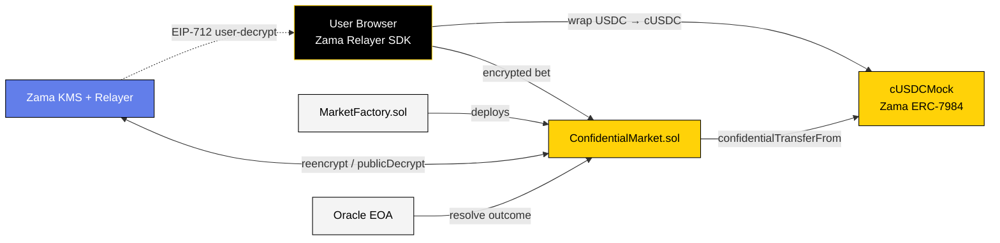
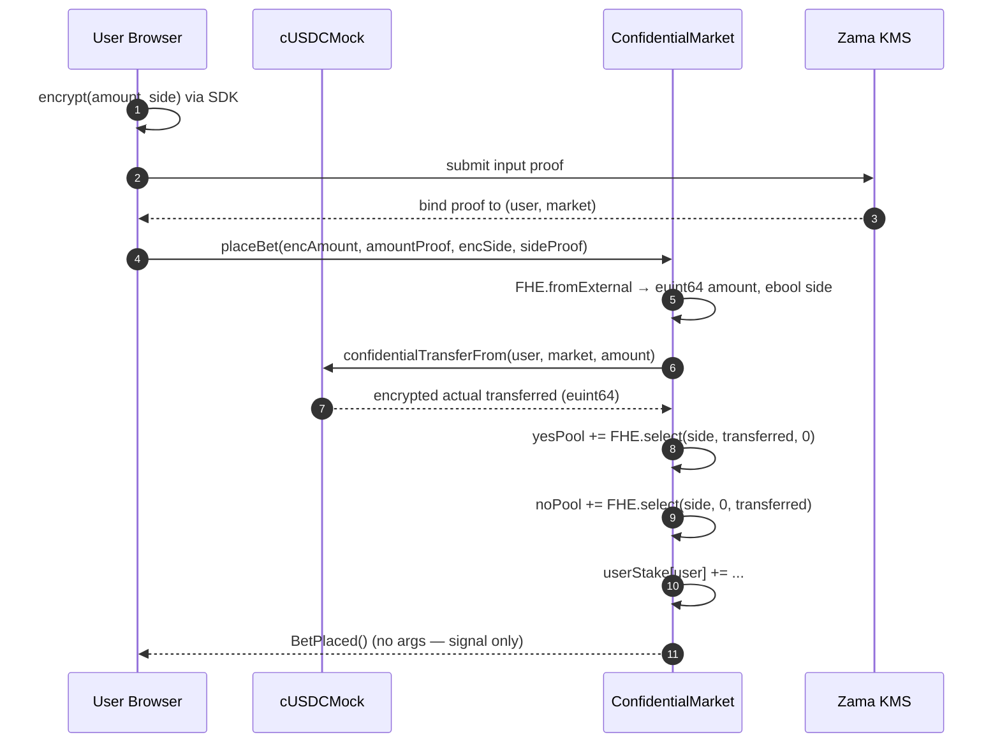

<div align="center">


# TruthMarket

**Confidential Prediction Markets on Zama FHEVM**


**Encrypted bets · K-anonymous odds · Non-custodial settlement**

[](https://truth-market-five.vercel.app/)
[](https://docs.zama.org/protocol)
[](https://sepolia.etherscan.io/address/0x69Dbcf4426dF9f6AD16c035b005635efF22579F6#code)
[](./LICENSE)

<br />

[**Open the app →**](https://truthmarket-v1.vercel.app/) &nbsp;·&nbsp; [3-min demo](https://your-demo-link) &nbsp;·&nbsp; [X thread](https://your-thread-link)

<sub>Submission — Zama Developer Program Mainnet Season 3 · Builder Track</sub>

</div>

---

## What it is

A binary prediction market where **bet amount and side are encrypted on-chain** for the entire market lifecycle, while aggregate market metadata stays public. Built on Zama Protocol's FHEVM and Ethereum Sepolia.

Every other prediction market broadcasts your position, direction, and history — tied to your wallet forever. TruthMarket encrypts what should have always been private (your edge) and leaves what makes markets useful (aggregate odds) public.

---

## Table of contents

- [Privacy boundaries](#privacy-boundaries)
- [Architecture](#architecture)
- [How it works](#how-it-works)
  - [1. Encrypted bet](#1-encrypted-bet)
  - [2. K-anonymous odds](#2-k-anonymous-odds)
  - [3. Resolve → Finalize → Claim](#3-resolve--finalize--claim)
- [Deployment (Sepolia)](#deployment-sepolia)
- [Tech stack](#tech-stack)
- [Frontend](#frontend)
- [Local development](#local-development)
- [Testing](#testing)
- [Security notes](#security-notes)
- [Known limitations & roadmap](#known-limitations--roadmap)
- [License](#license)

---

## Privacy boundaries

The privacy boundary is explicit and enforced at the protocol level:

| Layer                        | Public                                                                | Bettor (self, off-chain decrypt)         | Never revealed                                        |
| ---------------------------- | --------------------------------------------------------------------- | ---------------------------------------- | ----------------------------------------------------- |
| Market metadata              | Question, description, category, deadline, status, K-anon parameter   | —                                        | —                                                     |
| Public counters              | `betCount`, `lastSnapshotBetCount`, `snapshotCounter`                 | —                                        | —                                                     |
| Aggregate odds               | K-anonymous snapshot (released only after ≥K=3 new bets)              | —                                        | Live per-bet pool delta                               |
| Bet input                    | —                                                                     | Own bet only                             | Bet amount, bet side, per-wallet cumulative stake     |
| Per-user stake               | —                                                                     | Self (via EIP-712 user-decryption)       | Other wallets' stakes                                 |
| Payout                       | —                                                                     | Self (encrypted cUSDC credit)            | Payout amount                                         |
| Final pools (post-settle)    | Cleartext (needed for claim math)                                     | —                                        | —                                                     |
| ERC-20 deposit (`wrap()`)    | Public USDC top-up amount                                             | —                                        | Decoupled from per-bet amounts                        |

> **Note on identity:** the *transaction sender* is still public at the L1 layer
> (that's unavoidable for any Ethereum tx). What's hidden is everything about the
> *bet's content* — amount, direction, per-wallet totals, and payout.
| Payout                   | —                              | self (encrypted cUSDC credit)             | payout amount                                                              |
| Final pools (post-settle)| cleartext (needed for claim math) | —                                      | —                                                                          |
| ERC-20 deposit (`wrap()`)| public USDC top-up amount     | —                                         | — (decoupled from per-bet amounts)                                         |

---

## Architecture



**Components:**

| Component | Role | Trust |
|---|---|---|
| **User Browser** | Encrypts `(amount, side)` client-side via Zama SDK; holds decryption keys | Trusted for own keys |
| **MarketFactory** | Deploys and indexes markets | On-chain, immutable |
| **ConfidentialMarket** | Per-market: encrypted bet, K-anon snapshot, resolve, finalize, claim | On-chain, immutable |
| **cUSDCMock (ERC-7984)** | Confidential wrapped USDC — Zama's official collateral token | Zama-audited |
| **KMS + Relayer** | Threshold key management for FHE decryption | Zama-operated |
| **Oracle** | Off-chain outcome reporter (per market) | Market-specific EOA |

---

## How it works

### 1. Encrypted bet



**What's on-chain, what leaks:**

- The transaction **sender** is public.
- The **`BetPlaced()`** event carries **no arguments** — no amount, no side, no address in the payload.
- Every `FHE.add` produces a **new ciphertext handle**. The old handle's ACL doesn't carry over, which is precisely what makes step 2 possible.

### 2. K-anonymous odds

Pools are stored as `euint64` and are only revealed via a **snapshot** gated by a K-anonymity threshold:

```solidity
function refreshOdds() external {
    if (betCount - lastSnapshotBetCount < snapshotBatchK) revert TooFewBetsSinceSnapshot();
    FHE.makePubliclyDecryptable(yesPoolEnc);
    FHE.makePubliclyDecryptable(noPoolEnc);
    ...
}
```

Each successful bet creates a **new ciphertext handle** for the pool (via
`FHE.add`), and the public-decryption ACL applies to a specific handle — it
doesn't carry over. So the relayer can only return cleartext for the handle that
was active **at the moment a snapshot was triggered**. Because the snapshot
requires ≥K=3 new bets since the previous one, the diff between snapshots covers
at least K bets and can't be attributed to any individual wallet.

### Resolution and claim
- **`resolve(bool outcomeYes)`** (oracle, after deadline) — records the outcome
  and marks the final pool handles publicly decryptable.
- **`finalize(uint64 yes, uint64 no, bytes proof)`** (permissionless) — anyone
  pulls the cleartext pool values plus a KMS proof from the Zama relayer and
  submits them on-chain. `FHE.checkSignatures(handles, encoded, proof)` verifies
  the proof. The contract stores `yesPoolFinal` / `noPoolFinal` (now plaintext).
- **`claim()`** — payout is computed entirely in FHE:
  ```
  euint128 stake128 = FHE.asEuint128(userYesStake[msg.sender]);
  euint128 num      = FHE.mul(stake128, uint128(totalPool));
  euint64  payout   = FHE.asEuint64(FHE.div(num, uint128(winningPool)));
  cUsdc.confidentialTransfer(msg.sender, payout);
  ```
  The 128-bit intermediate prevents the `stake × totalPool` overflow that
  64-bit math would silently hit. The payout is delivered via ERC-7984
  `confidentialTransfer` — only the recipient can decrypt their credited balance.

Void paths (empty winning pool, or oracle missed `deadline + disputeWindow`)
refund the full stake via the same encrypted-transfer channel.

## Sepolia deployment (v3 — encrypted bets only)

We deploy a single contract; collateral comes from Zama's official tokens.

| Contract                     | Address |
|------------------------------|---------|
| `MarketFactory` v3 (ours, verified) | [`0x69Dbcf4426dF9f6AD16c035b005635efF22579F6`](https://sepolia.etherscan.io/address/0x69Dbcf4426dF9f6AD16c035b005635efF22579F6#code) |
| Confidential USDC `cUSDCMock`| [`0x7c5BF43B851c1dff1a4feE8dB225b87f2C223639`](https://sepolia.etherscan.io/address/0x7c5BF43B851c1dff1a4feE8dB225b87f2C223639) **Zama official** |
| Underlying USDC (public mint)| [`0x9b5Cd13b8eFbB58Dc25A05CF411D8056058aDFfF`](https://sepolia.etherscan.io/address/0x9b5Cd13b8eFbB58Dc25A05CF411D8056058aDFfF) **Zama official** |

Three demo markets are seeded in `deployments/sepolia/demo-markets.json`.
A live confidential smoke run on Sepolia placed three encrypted bets and a
post-K-anon snapshot, available at
[`scripts/smoke-bet-sepolia.ts`](./scripts/smoke-bet-sepolia.ts).

## Architecture

```
contracts/
├─ ConfidentialMarket.sol   per-market: encrypted bet, K-anon snapshot, resolve, finalize, claim
├─ MarketFactory.sol        deploys + indexes markets
├─ UmaResolver.sol          optional UMA Optimistic Oracle V3 resolution adapter (see docs/UMA.md)
├─ uma/interfaces/          vendored minimal UMA interfaces
└─ mocks/                   TEST-ONLY local stand-ins for the official Zama tokens
```

### Optional: UMA Optimistic Oracle V3 resolution

Markets can be resolved through **UMA's real OOV3 on Sepolia** instead of a
trusted EOA oracle — pass the `UmaResolver` address as the `oracle` when creating
a market. Outcomes are asserted with a bond and resolve optimistically after a
liveness window. Full design, deploy, and a real-Sepolia end-to-end demo are in
**[`docs/UMA.md`](docs/UMA.md)** (including the testnet DVM/dispute limitation).

Built on:
- [`@fhevm/solidity ^0.11.1`](https://docs.zama.org/protocol/solidity-guides)
- [`@openzeppelin/confidential-contracts ^0.4.0`](https://github.com/OpenZeppelin/openzeppelin-confidential-contracts) (ERC-7984)
- [`@fhevm/hardhat-plugin ^0.4.2`](https://github.com/zama-ai/fhevm-hardhat-template)

## Development

```bash
npm install
npm run compile
npm test                     # 9 tests against the FHEVM mock
```

Test coverage:
- encrypted `(amount, side)` round-trip + per-user stake accumulation
- K-anonymity gate (`refreshOdds` rejects before K, allows after, re-gates after each bet)
- resolve → finalize (with KMS proof) → claim (pro-rata, with euint128 payout math)
- double-claim guard
- void paths (empty winning pool, oracle-timeout refunds)
- deadline + oracle gating

### Deploy to Sepolia

Copy `.env.example` → `.env` and fill in `SEPOLIA_RPC_URL`, `PRIVATE_KEY`,
`ETHERSCAN_API_KEY`.

```bash
npx hardhat run scripts/deploy.ts --network sepolia
npx hardhat run scripts/seed-demo-markets.ts --network sepolia
npx hardhat run scripts/smoke-bet-sepolia.ts --network sepolia
```

## Frontend (`web/`)

Next.js 15 / App Router with shadcn/ui, wagmi v2, RainbowKit, the Zama Relayer
SDK (web build), and a Solar Burst design system (light, vivid orange + sky
blue + white).

The frontend is split into two distinct surfaces:

- **Landing (`/`)** — marketing page on the orange/sky "Solar Burst" palette, with the
  `HiddenConsensus` generative flow-field art (see `web/art/hidden-consensus.md`),
  scroll-driven motion, a Polymarket/Kalshi comparison, and a how-it-works walkthrough.
- **App / dashboard (`/markets`, `/markets/[address]`, `/create`, `/portfolio`)** — a
  separate "zard-dark" surface (light theme, golden-yellow + black controls, scoped via
  the `.theme-dash` class) for actually trading.

| Route                 | Purpose |
|-----------------------|---------|
| `/`                   | Landing page (marketing + algorithmic art + motion). |
| `/markets`            | Dashboard: market explorer with public odds, search/filter, volume + position stats. |
| `/markets/[address]`  | Market detail: public odds, encrypted bet panel, your own position (always visible to you), claim, resolution controls. |
| `/create`             | Open a new confidential market. |
| `/portfolio`          | Your positions (shown from a local record, with an on-chain `userDecrypt` verify) + sealed balance. |

Public odds and volume blend whatever the protocol has revealed on-chain with a
deterministic, address-seeded baseline (`web/src/lib/demo.ts`), so a brand-new market
still reads as a real market; per-wallet positions stay encrypted end-to-end. Your own
position is never hidden from you — the browser that composed the bet keeps a local
cleartext record (`web/src/lib/positions.ts`).

The collateral UX hides the confidential token under "USDC" — the first bet
triggers a one-time top-up that mints test USDC, wraps it into Zama's cUSDC,
and grants the market operator status. Subsequent bets are a single encrypted
`placeBet` tx. The USDC→cUSDC conversion is visualized live with a
`WrapFlow` animation.

A small in-site faucet (`Faucet.tsx`) mints test USDC for new users — Circle's
Sepolia USDC cannot be wrapped into Zama's cUSDC because the wrapper is
hard-bound to the USDCMock address, so we mint that one specifically.

### Run locally

```bash
cd web
npm install --legacy-peer-deps
npm run dev          # http://localhost:3000
```

`web/.env.local`:
```
NEXT_PUBLIC_SEPOLIA_RPC_URL=https://eth-sepolia.g.alchemy.com/v2/<key>
NEXT_PUBLIC_WALLETCONNECT_PROJECT_ID=<your-project-id>
```

### Deploy on Netlify

`netlify.toml` points Netlify at `web/` with the `@netlify/plugin-nextjs`
runtime and emits the `Cross-Origin-Opener-Policy` / `Cross-Origin-Embedder-Policy`
headers the Zama relayer SDK requires for SharedArrayBuffer + WASM workers.
