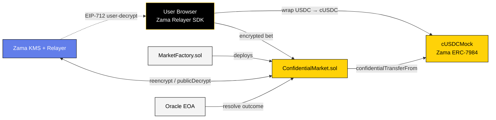
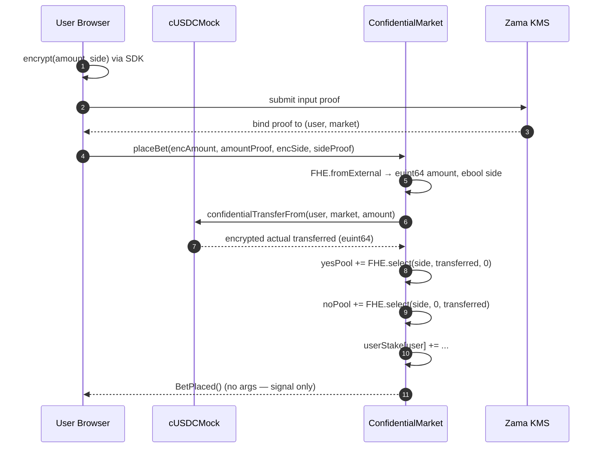
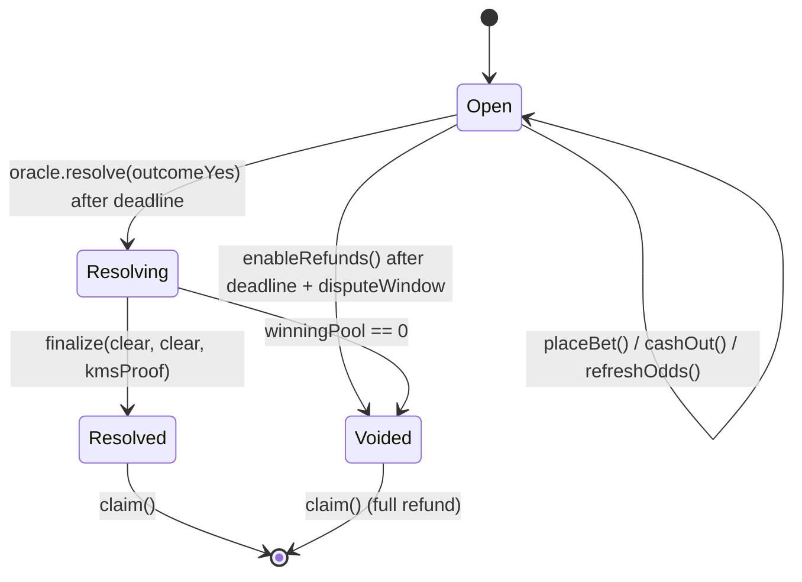

<div align="center">


# TruthMarket

**Confidential Prediction Markets on Zama FHEVM**

Encrypted bets · K-anonymous odds · Non-custodial settlement

[](https://truth-market-five.vercel.app/)
[](https://docs.zama.org/protocol)
[](https://sepolia.etherscan.io/address/0x69Dbcf4426dF9f6AD16c035b005635efF22579F6#code)
[](./LICENSE)

<br />

[**Open the app →**](https://truth-market-five.vercel.app/) &nbsp;·&nbsp; [3-min demo](https://your-demo-link) &nbsp;·&nbsp; [X thread](https://your-thread-link)

<sub>Submission — Zama Developer Program Mainnet Season 3 · Builder Track</sub>

</div>

---

## What it is

A binary prediction market where **bet amount and side are encrypted on-chain** for the entire market lifecycle, while aggregate market metadata stays public. Built on Zama Protocol's FHEVM and Ethereum Sepolia.

Every other prediction market broadcasts your position, direction, and history — tied to your wallet forever. TruthMarket encrypts what should have always been private (your edge) and leaves what makes markets useful (aggregate odds) public.

---

## Table of contents

- [Privacy boundaries](#privacy-boundaries)
- [Architecture](#architecture)
- [How it works](#how-it-works)
  - [1. Encrypted bet](#1-encrypted-bet)
  - [2. K-anonymous odds](#2-k-anonymous-odds)
  - [3. Resolve → Finalize → Claim](#3-resolve--finalize--claim)
- [Deployment (Sepolia)](#deployment-sepolia)
- [Tech stack](#tech-stack)
- [Frontend](#frontend)
- [Local development](#local-development)
- [Testing](#testing)
- [Security notes](#security-notes)
- [Known limitations & roadmap](#known-limitations--roadmap)
- [License](#license)

---

## Privacy boundaries

The privacy boundary is explicit and enforced at the protocol level:

| Layer                        | Public                                                                | Bettor (self, off-chain decrypt)         | Never revealed                                        |
| ---------------------------- | --------------------------------------------------------------------- | ---------------------------------------- | ----------------------------------------------------- |
| Market metadata              | Question, description, category, deadline, status, K-anon parameter   | —                                        | —                                                     |
| Public counters              | `betCount`, `lastSnapshotBetCount`, `snapshotCounter`                 | —                                        | —                                                     |
| Aggregate odds               | K-anonymous snapshot (released only after ≥K=3 new bets)              | —                                        | Live per-bet pool delta                               |
| Bet input                    | —                                                                     | Own bet only                             | Bet amount, bet side, per-wallet cumulative stake     |
| Per-user stake               | —                                                                     | Self (via EIP-712 user-decryption)       | Other wallets' stakes                                 |
| Payout                       | —                                                                     | Self (encrypted cUSDC credit)            | Payout amount                                         |
| Final pools (post-settle)    | Cleartext (needed for claim math)                                     | —                                        | —                                                     |
| ERC-20 deposit (`wrap()`)    | Public USDC top-up amount                                             | —                                        | Decoupled from per-bet amounts                        |

> **Note on identity:** the *transaction sender* is still public at the L1 layer
> (that's unavoidable for any Ethereum tx). What's hidden is everything about the
> *bet's content* — amount, direction, per-wallet totals, and payout.

---

## Architecture



**Components:**

| Component | Role | Trust |
|---|---|---|
| **User Browser** | Encrypts `(amount, side)` client-side via Zama SDK; holds decryption keys | Trusted for own keys |
| **MarketFactory** | Deploys and indexes markets | On-chain, immutable |
| **ConfidentialMarket** | Per-market: encrypted bet, K-anon snapshot, resolve, finalize, claim | On-chain, immutable |
| **cUSDCMock (ERC-7984)** | Confidential wrapped USDC — Zama's official collateral token | Zama-audited |
| **KMS + Relayer** | Threshold key management for FHE decryption | Zama-operated |
| **Oracle** | Off-chain outcome reporter (per market) | Market-specific EOA |

---

## How it works

### 1. Encrypted bet



**What's on-chain, what leaks:**

- The transaction **sender** is public.
- The **`BetPlaced()`** event carries **no arguments** — no amount, no side, no address in the payload.
- Every `FHE.add` produces a **new ciphertext handle**. The old handle's ACL doesn't carry over, which is precisely what makes step 2 possible.

### 2. K-anonymous odds

Pools are stored as `euint64` and are only revealed via a **snapshot** gated by a K-anonymity threshold:

```solidity
function refreshOdds() external {
    if (betCount - lastSnapshotBetCount < snapshotBatchK) revert TooFewBetsSinceSnapshot();
    FHE.makePubliclyDecryptable(yesPoolEnc);
    FHE.makePubliclyDecryptable(noPoolEnc);
    // …
}
```



```mermaid
gantt
    title K-anonymous snapshot gating (K=3)
    dateFormat X
    axisFormat %s
    section Bets
    Bet 1 :b1, 0, 1
    Bet 2 :b2, 1, 2
    Bet 3 :b3, 2, 3
    Bet 4 :b4, 4, 5
    Bet 5 :b5, 5, 6
    Bet 6 :b6, 6, 7
    section Snapshots
    Snapshot 1 (covers bets 1-3) :crit, s1, 3, 4
    Snapshot 2 (covers bets 4-6) :crit, s2, 7, 8
```

**Why this works:** Each `FHE.add` returns a new ciphertext handle. The public-decryption ACL applies to a specific handle — it doesn't carry over. So the relayer can only return cleartext for the handle that was **active at snapshot time**. Between snapshots there are ≥K=3 bets, so no diff maps to a single wallet.

### 3. Resolve → Finalize → Claim



**Payout math** (`claim()`), fully in FHE:

```solidity
euint128 stake128 = FHE.asEuint128(userYesStake[msg.sender]);
euint128 num = FHE.mul(stake128, uint128(totalPool));
euint64 payout = FHE.asEuint64(FHE.div(num, uint128(winningPool)));
cUsdc.confidentialTransfer(msg.sender, payout);
```

The **128-bit intermediate** prevents the `stake × totalPool` overflow that 64-bit math would silently hit. Payout is delivered via ERC-7984 `confidentialTransfer` — only the recipient can decrypt their credited balance.

Void paths (empty winning pool, or oracle missed `deadline + disputeWindow`) refund the full stake via the same encrypted-transfer channel.

---

## Deployment (Sepolia)

A single custom contract, plus Zama's official collateral tokens.

| Contract                     | Address | Provenance |
| ---------------------------- | ------- | ---------- |
| `MarketFactory` v3           | [`0x69Dbcf4426dF9f6AD16c035b005635efF22579F6`](https://sepolia.etherscan.io/address/0x69Dbcf4426dF9f6AD16c035b005635efF22579F6#code) | Ours, verified |
| Confidential USDC (`cUSDCMock`) | [`0x7c5BF43B851c1dff1a4feE8dB225b87f2C223639`](https://sepolia.etherscan.io/address/0x7c5BF43B851c1dff1a4feE8dB225b87f2C223639) | **Zama official** |
| Underlying USDC (public mint) | [`0x9b5Cd13b8eFbB58Dc25A05CF411D8056058aDFfF`](https://sepolia.etherscan.io/address/0x9b5Cd13b8eFbB58Dc25A05CF411D8056058aDFfF) | **Zama official** |

Three demo markets seeded in [`deployments/sepolia/demo-markets.json`](./deployments/sepolia/demo-markets.json). Live confidential smoke run: [`scripts/smoke-bet-sepolia.ts`](./scripts/smoke-bet-sepolia.ts).

---

## Tech stack

| Layer | Technology | Version |
|---|---|---|
| FHE primitives | [`@fhevm/solidity`](https://docs.zama.org/protocol/solidity-guides) | ^0.11.1 |
| Confidential tokens | [`@openzeppelin/confidential-contracts`](https://github.com/OpenZeppelin/openzeppelin-confidential-contracts) (ERC-7984) | ^0.4.0 |
| Toolchain | [`@fhevm/hardhat-plugin`](https://github.com/zama-ai/fhevm-hardhat-template) | ^0.4.2 |
| Frontend | Next.js 15 (App Router) | 15.x |
| Wallet | wagmi v2 + viem + RainbowKit | latest |
| SDK | [`@zama-fhe/sdk`](https://docs.zama.org/protocol/sdk) (web build) | v3 |
| UI | shadcn/ui + Tailwind + framer-motion + lucide-react | latest |
| Hosting | Netlify (frontend) + Sepolia (contracts) | — |

---

## Frontend

Two distinct surfaces, deliberately separate:

| Route | Purpose | Surface |
|---|---|---|
| `/` | Landing (marketing + algorithmic art + motion) | Solar Burst / Noir editorial |
| `/markets` | Market explorer — public odds, search, filter, volume | `zard-dark` dashboard (yellow + black) |
| `/markets/[address]` | Market detail — public odds, encrypted bet panel, your own position, claim, resolution controls | `zard-dark` |
| `/create` | Open a new confidential market | `zard-dark` |
| `/portfolio` | Your positions + sealed balance (with on-chain `userDecrypt` verify) | `zard-dark` |

**Display strategy:** public odds and volume blend whatever the protocol has revealed on-chain with a deterministic, address-seeded baseline ([`web/src/lib/demo.ts`](./web/src/lib/demo.ts)), so a brand-new market still reads as a real market. Per-wallet positions stay encrypted end-to-end. **Your own position is never hidden from you** — the browser that composed the bet keeps a local cleartext record ([`web/src/lib/positions.ts`](./web/src/lib/positions.ts)).

**Collateral UX:** the confidential token is hidden behind "USDC" — the first bet triggers a one-time top-up that mints test USDC, wraps into cUSDC, and grants the market operator status. Subsequent bets are a single encrypted `placeBet` tx. The wrap flow is visualized live with the `WrapFlow` animation.

---

## Local development

### Prerequisites

- Node.js 20+
- npm 10+
- Sepolia RPC + funded deployer key (for on-chain deploy)

### Contracts

```bash
npm install
npm run compile
npm test  # 9 tests against FHEVM mock
```

### Frontend

```bash
cd web
npm install --legacy-peer-deps
npm run dev  # http://localhost:3000
```

`web/.env.local`:

```
NEXT_PUBLIC_SEPOLIA_RPC_URL=https://eth-sepolia.g.alchemy.com/v2/<key>
NEXT_PUBLIC_WALLETCONNECT_PROJECT_ID=<your-project-id>
```

### Deploy to Sepolia

Copy `.env.example` → `.env` and fill in `SEPOLIA_RPC_URL`, `PRIVATE_KEY`, `ETHERSCAN_API_KEY`.

```bash
npx hardhat run scripts/deploy.ts --network sepolia
npx hardhat run scripts/seed-demo-markets.ts --network sepolia
npx hardhat run scripts/smoke-bet-sepolia.ts --network sepolia
```

### Deploy on Netlify

`netlify.toml` points Netlify at `web/` with `@netlify/plugin-nextjs`. Emits the `Cross-Origin-Opener-Policy` / `Cross-Origin-Embedder-Policy` headers the Zama relayer SDK requires for SharedArrayBuffer + WASM workers.

---

## Testing

| Test path | What it covers |
|---|---|
| `test/placeBet.ts` | Encrypted `(amount, side)` round-trip + per-user stake accumulation |
| `test/kAnon.ts` | K-anonymity gate — `refreshOdds` rejects before K, allows after, re-gates after each bet |
| `test/resolveFinalize.ts` | Resolve → finalize (with KMS proof) → claim (pro-rata, euint128 payout math) |
| `test/doubleClaim.ts` | Double-claim guard |
| `test/void.ts` | Void paths — empty winning pool, oracle-timeout refunds |
| `test/gating.ts` | Deadline + oracle gating |

Run all:

```bash
npm test
```

Sepolia smoke run:

```bash
npx hardhat run scripts/smoke-bet-sepolia.ts --network sepolia
```

Places three encrypted bets and triggers a post-K-anon snapshot on the live network.

---

## Security notes

### Design guarantees

- ✅ Bet amounts and directions are **never** in plaintext on-chain
- ✅ `BetPlaced` event has no arguments — no leak via event indexing
- ✅ `FHE.select` used for branchless side split — calldata reveals nothing
- ✅ `euint128` widening in payout math prevents overflow
- ✅ `FHE.checkSignatures` in `finalize()` — KMS proof required
- ✅ Void paths handle empty winning pool and oracle timeout

### Threat model

| Adversary | Can they learn... | Mitigation |
|---|---|---|
| On-chain observer | Bet amount, side, per-user stake | ❌ Encrypted on-chain |
| On-chain observer | Wallet placed *some* bet | ⚠️ `msg.sender` public — unavoidable at L1 |
| Timing-based copy trader | Content of the copied bet | ❌ Encrypted — signal is useless |
| Malicious oracle | Wrong outcome (before finalize) | ⚠️ Trust in oracle EOA; see roadmap |
| Zama KMS operator | Bet plaintexts | ❌ Threshold MPC; no single node holds keys |

### Audit status

Contracts have **not** received an independent audit. Built on top of the audited Zama FHEVM primitives and OpenZeppelin's confidential-contracts. Code review welcome — open an issue or PR.

---

## Known limitations & roadmap

| Limitation | Status | Planned fix |
|---|---|---|
| Oracle is a trusted EOA per market | Known | Multisig oracle option; dispute window between `resolve()` and `finalize()` (v4) |
| `finalize()` runs immediately after `resolve()` | Known | Enforce `disputeWindow` gate on finalize (v4) |
| `MarketFactory.marketIndex` is 1-indexed | Known footgun | Move to 0-indexed with existence check (v4) |
| No independent security audit | Known | Post-mainnet |
| Zama KMS is centralized (threshold) | Protocol-level | Follows Zama roadmap |

---

## Contributing

Contributions welcome — especially:

- Independent code review of the contract
- UX polish on the confidential bet flow
- Additional test vectors for edge cases (empty pool, oracle timeout paths)

Open an issue before large changes.

---

## License

[MIT](./LICENSE) © 2026 hosein-ul

---

## Attribution

Built for the [**Zama Developer Program Mainnet Season 3 — Builder Track**](https://www.zama.org/post/zama-developer-program-mainnet-season-3-composable-privacy-is-the-key).

Powered by:

- [Zama Protocol](https://docs.zama.org/protocol) — FHE for confidential smart contracts
- [OpenZeppelin Confidential Contracts](https://github.com/OpenZeppelin/openzeppelin-confidential-contracts) — ERC-7984 reference
- [FHEVM Hardhat template](https://github.com/zama-ai/fhevm-hardhat-template) — dev toolchain

<div align="center">

<br />

<sub>TruthMarket · Confidential Prediction Markets · Sepolia testnet</sub>

</div>
